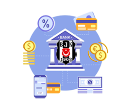

# **Beşiktaş Bank A.Ş. - Banka Otomasyon Uygulaması**
Bu, Java kullanarak geliştirilmiş bir banka otomasyon uygulamasıdır. Sadece masaüstü uygulaması olarak geçer ve diğer platformlarda çalışmaz. Bu uygulama, bireysel müşteriler, banka çalışanları ve banka müdürü tarafından kullanılan üç farklı kullanıcı profiline sahiptir.

## Uygulamanın Amacı
Bu uygulamanın amacı, banka müdürü, çalışanları ve bireysel müşteriler arasında kolay bir şekilde bankacılık işlemlerinin yapılmasını sağlamaktır.

## Uygulamanın Özellikleri
Bu uygulamada, banka müdürü, banka çalışanları ve bireysel müşterilerin yapabilecekleri işlemler şunlardır:

### Banka Müdürü: 
-	Bankaya yeni banka çalışanı kaydı ekleme, banka çalışanı bilgisi güncelleme, banka çalışanı kaydını silme, banka çalışanlarını listeleme
-	Bankada kaydı bulunan müşterilerin kredi başvurularını listeleme, onaylama ve reddetme

### Banka Yetkilisi: 
-	Bankaya yeni müşteri kaydı ekleme, müşteri bilgisi güncelleme, müşteri kaydını silme, müşterileri listeleme
-	Bankada kaydı bulunan müşterilere yeni banka hesabı açabilme, banka hesabı silme, banka hesaplarını listeleme
-	Müşterinin hesabına para yatırma, müşteri hesabından para çekme

### Bireysel Müşteri:
-	Kendine ait olan banka hesaplarını liste şeklinde görüntüleyebilme
-	Banka hesap bakiyelerini takip edebilme
-	Aynı bankanın farklı bir müşterisine para transferi yapabilme, para çekme
-	Kendi banka hesapları arasında para transferi yapabilme
-   Kredi başvurusunda bulunma ve kredi başvuru sonucunu görüntüleyebilme

### Proje Sunumu:
- **BİLGİ**: Bu dosyada uygulamamın proje sunum raporu yer almaktadır. İnceleyebilirsiniz:  
[Proje Sunum Raporu](Project-Presentation/ProjeRaporSunumu.pdf)

## Uygulama Ekran Görüntüleri
<table>
  <tr>
    <td>1</td>
     <td>2</td> 
  <tr>
    <td></td>
    <td></td>   
 </table>

<table>
  <tr>
    <td>3</td>
     <td>4</td>
  <tr>
    <td></td>
    <td></td>
 </table>

 <table>
  <tr>
    <td>5</td>
  <tr>
    <td></td>
 </table>

 <table>
  <tr>
    <td>6</td>
  <tr>
    <td></td>
 </table>

  <table>
  <tr>
    <td>7</td>
     <td>8</td>
  <tr>
    <td></td>
    <td></td>
 </table>
  
<table>
  <tr>
    <td>9</td>
  <tr>
    <td></td>
 </table>

 <table>
  <tr>
    <td>10</td>
  <tr>
    <td></td>
 </table>

 <table>
  <tr>
    <td>11</td>
  <tr>
    <td></td>
 </table>

 <table>
  <tr>
    <td>12</td>
  <tr>
    <td></td>
 </table>

---

## Projeye Katılan Diğer Üyeler
* [Bayram Bayraktar](https://github.com/Bayrak-tar)

---

## İletişim
Eğer herhangi bir sorunuz, öneriniz veya geri bildiriminiz varsa, bana aşağıdaki kanallardan ulaşabilirsiniz:
- LinkedIn: [LinkedIn Profilim](https://www.linkedin.com/in/hsynkbulut/)
- Medium: [Medium Profilim](https://medium.com/@hsynkbulut)
- E-posta: [E-mail adresim](mailto:hsyn.kbulut@gmail.com)